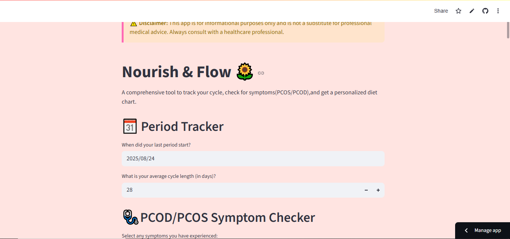

# WellnessCycle
A Python app designed to support women’s health by predicting the next period date, estimating PCOS/PCOD likelihood, calculating BMI &amp; ideal weight, and providing a customized diet chart for better lifestyle management.

✨ Features

    🔮 Period Prediction – Estimate your next menstrual cycle date.
    
    🩺 PCOS/PCOD Likelihood – Understand the chances of hormonal imbalance (common in many women today).
    
    ⚖️ BMI & Ideal Weight – Calculate body mass index and see the recommended weight range.
    
    🥗 Personalized Diet Plan – Get a health-friendly diet chart tailored to your BMI and condition.

🚀 Tech Stack

    Python
    
    Streamlit (for building the web app)
    

📂 Project Structure

        ├── health_tracker.py          # Main web app code  
        ├── README.md                  # Project documentation  
        ├── LICENSE                    # Open-source license  
         

⚡ Usage

    Clone this repo:
    
    git clone https://github.com/riyasha-gif/WellnessCycle.git
    
    Install dependencies:
    
    pip install -r requirements.txt
    
    Run the app:
    
    streamlit run health_tracker.py

🧑‍🤝‍🧑 Contribution

    Contributions are welcome! Feel free to fork this repo, create a new branch, and submit a pull request.

📜 License

    This project is open-source and available under the MIT License.
